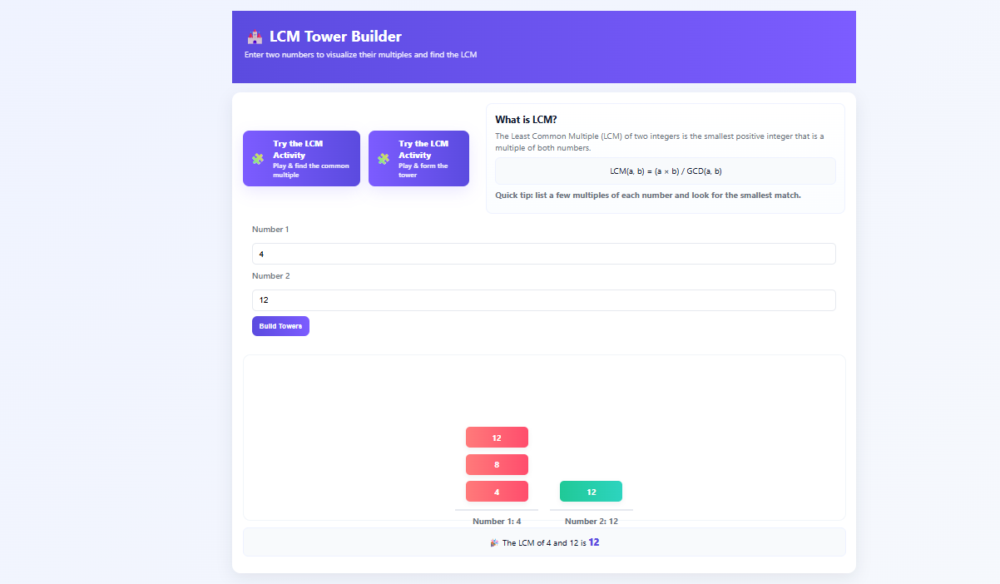
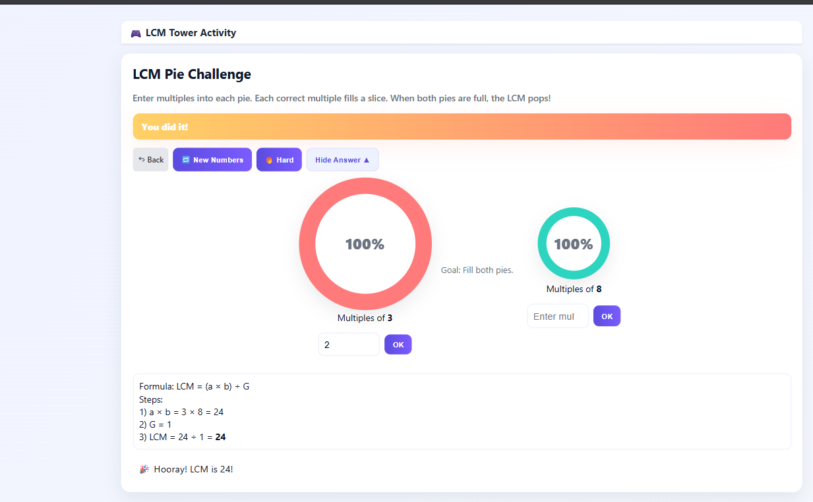

# LCM Tower - Interactive Learning Tool

## Overview
LCM Tower is an interactive web-based tool designed to help students learn and visualize the concept of Least Common Multiple (LCM). The application provides engaging activities such as building towers, filling pie charts, and solving puzzles to discover the LCM of two numbers.

## Features
- **Interactive Towers**: Build towers by entering multiples of two numbers and find their LCM interactively.
- **Pie Chart Activity**: Fill pie charts by entering multiples for two numbers. Each correct multiple fills a slice, and the LCM is revealed when both pies are full.
- **Number Tiles Puzzle**: Drag and drop tiles to match multiples and find the LCM.
- **Dynamic Number Generation**: Generate random numbers or manually input numbers to explore their LCM.
- **Hard Mode**: Challenge yourself with double-digit numbers and apply the GCD to simplify the problem.
- **Show Answer**: Reveal the formula and step-by-step calculation for the LCM.

## How It Works
1. **Enter Numbers**: Input two numbers or generate random ones.
2. **Build Towers**: Fill the towers by entering multiples of the numbers.
3. **Fill Pie Charts**: Enter multiples into each pie. Each correct multiple fills a slice. When both pies are full, the LCM pops!
4. **Find the LCM**: Complete the towers or pies to reveal the LCM.
5. **Apply GCD**: In hard mode, divide the numbers by their GCD to simplify the problem.
6. **Show Answer**: Use the formula `LCM(a, b) = (a × b) ÷ GCD(a, b)` to verify the result.

## Installation
1. Clone the repository:
   ```bash
   git clone https://github.com/Ela160403/LCM-website.git
   ```
2. Navigate to the project directory:
   ```bash
   cd LCM-website
   ```
3. Start a local server (e.g., XAMPP) and place the project in the `htdocs` folder.
4. Open the application in your browser:
   ```
   http://localhost/lcm
   ```

## File Structure
- `index.php`: Main entry point for the LCM Tower activity.
- `activity.php`: Contains the Pie Chart Activity.
- `tiles.php`: Implements the Number Tiles Puzzle.
- `style.css`: Stylesheet for the application.
- `script.js`: JavaScript for animations and interactivity.

## Technologies Used
- **Frontend**: HTML, CSS, JavaScript
- **Backend**: PHP
- **Server**: XAMPP (Apache, MySQL, PHP, Perl)

## Contributing
Contributions are welcome! Feel free to fork the repository and submit pull requests.

## Author
- **Ela160403**

## Acknowledgments
Special thanks to educators and students who provided feedback to make this tool more engaging and effective.

## Screenshots

Below are some screenshots of the LCM Tower application in action:

1. 
2. 
3. 
4. 
5. 
6. 
7. 